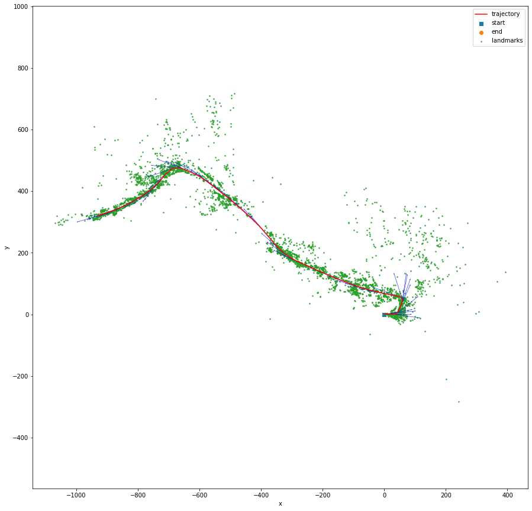

# Visual-Inertial SLAM
This is the project 3 of the course UCSD ECE276A: Sensing & Estimation in Robotics.

|  | 
|:--:| 
| Visual features matched across the left-right camera frames (left) and across time (right) |

Simultaneous localization and mapping (SLAM) is an important topic in robotics. It tries to utilize sensor data and user input to estimate the agent’s state and update a map of the surrounding environment at the same time. With the improvements in computing speed on end-devices and the availability of low-cost sensors, its algorithms are now widely used in robot navigation, robot mapping, and autonomous vehicles.

In this project, we propose a solution for visual-inertial SLAM using EKF. The observation of this method is only based on visual features. The solution is then evaluated using data collected from an IMU and a stereo camera on a car

## Screenshots

| IMU-based SLAM | Visual-based SLAM |
|---|---|
|||
|||

## References
* [UCSD ECE276A: Sensing & Estimation in Robotics](https://natanaso.github.io/ece276a/)